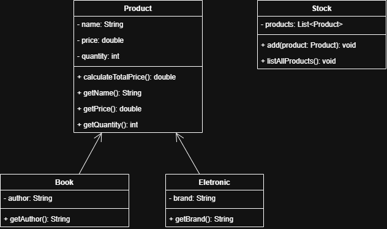

# Desafio Java Básico

Nesse desafio você irá praticar o básico de java com Programação Orientada a Objetos (POO). O desafio será um pequeno estoque.

Você irá criar as seguintes classes:

- `Product` -> Representa um produto.
- `Book` -> Especialização de `Product`.
- `Eletronic` -> Especialização de `Product`.
- `Stock` -> Representação do estoque.

Abaixo está a modelagem de classes em UML para a conclusão do desafio.

Obs: Caso você não conheça UML bem, o `-` representa um método/atributo privado e `+` público. A seta representa uma relação de especialização (herança).

Após modelar o sistema, crie uma classe para testar o funcionamento. Caso queira, pode incluir a entrada de dados pelo usuário com a classe `Scanner`, por exemplo.